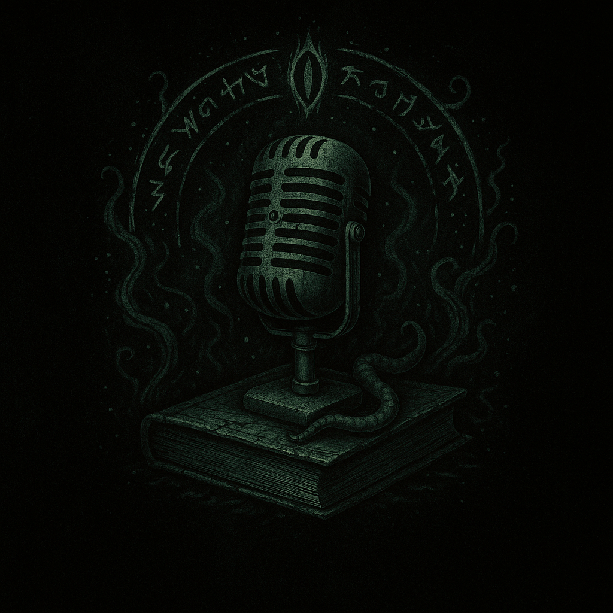

# 🎙️ Necro Tongue App




`NecroTongueApp` is a dictation tool designed to allow quick, low-friction voice-to-text transcription.

All processing happens locally via your own models — nothing is sent to the cloud.


## 💡 How it works

User defines Keyboard Combos and Prompts to refine the transcribed text with.

- 🎤 **Press & hold** your hotkey to record
- 📁 Audio is saved temporarily as a `.wav` file
- 🧠 The file is transcribed using a local **Whisper** model
- ✨ A local LLM model refines the text (e.g., improves grammar or style)
- 📋 The final result is copied to clipboard, ready to paste anywhere


## ⚙️ Requirements

- macOS with a powerful chipset (Apple Silicon recommended)  
  _Note: Models can be replaced with smaller ones or run on CPU if needed_
- Installed `brew install llama.cpp`
- Installed `brew install whisper-cpp`

## 👾 Models:

- Speech-to-text:
    https://huggingface.co/ggerganov/whisper.cpp/tree/main
- Text model:
    https://huggingface.co/models?sort=trending&search=llama+gguf


## 🧱 Based on:
* https://github.com/ggml-org/whisper.cpp
* https://github.com/ggml-org/llama.cpp


## 🚀 Launch the app
```bash
poetry run python3 necrotongue/entrypoint.py
```
